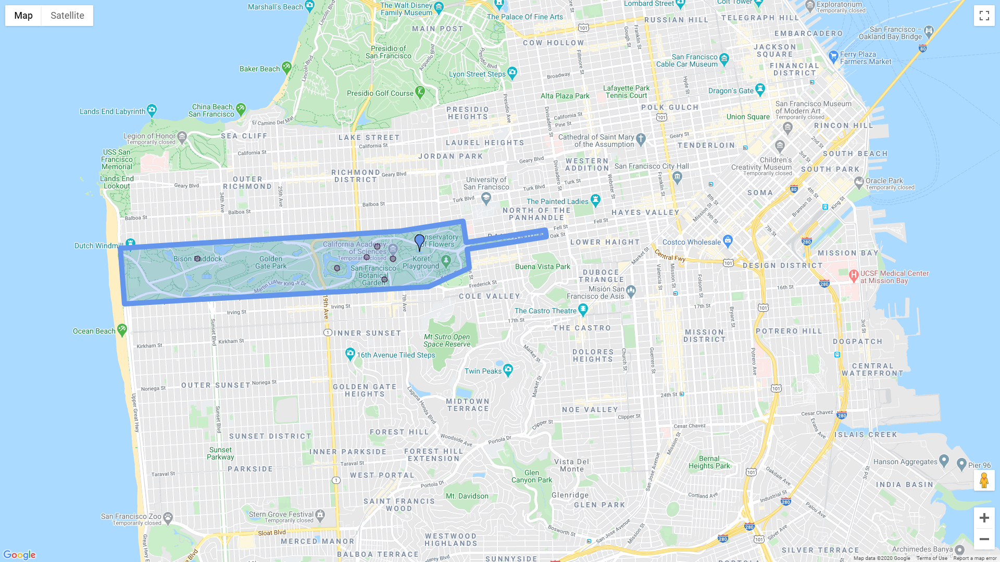

gmplot
======

A matplotlib-like interface to render all the data you'd like on top of Google Maps.

Several plotting methods make creating exploratory map views effortless.

To install: ``pip install gmplot``

Documentation (with examples): `API Reference <https://github.com/gmplot/gmplot/wiki>`_

Crash course
------------

.. code:: python

    import gmplot

    # Create the map plotter:
    apikey = '' # (your API key here)
    gmap = gmplot.GoogleMapPlotter(37.766956, -122.448481, 14, apikey=apikey)

    # Outline the Golden Gate Park:
    golden_gate_park = zip(*[
        (37.771269, -122.511015),
        (37.773495, -122.464830),
        (37.774797, -122.454538),
        (37.771988, -122.454018),
        (37.773646, -122.440979),
        (37.772742, -122.440797),
        (37.771096, -122.453889),
        (37.768669, -122.453518),
        (37.766227, -122.460213),
        (37.764028, -122.510347)
    ])
    gmap.polygon(*golden_gate_park, color='cornflowerblue', edge_width=10)

    # Highlight some attractions:
    attractions_lats, attractions_lngs = zip(*[
        (37.769901, -122.498331),
        (37.768645, -122.475328),
        (37.771478, -122.468677),
        (37.769867, -122.466102),
        (37.767187, -122.467496),
        (37.770104, -122.470436)
    ])
    gmap.scatter(attractions_lats, attractions_lngs, color='#3B0B39', size=40, marker=False)

    # Mark a hidden gem:
    gmap.marker(37.770776, -122.461689, color='cornflowerblue')

    # Draw the map:
    gmap.draw('map.html')

----

Inspired by Yifei Jiang's (jiangyifei@gmail.com) `pygmaps <http://code.google.com/p/pygmaps/>`_ module.
